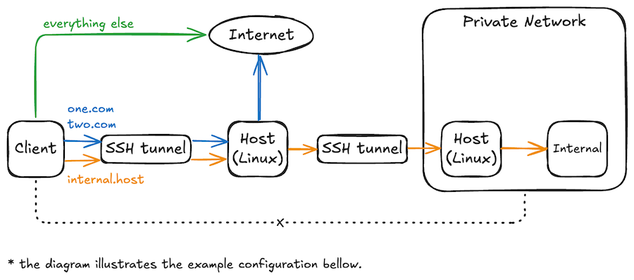

# sshtun


Configure network traffic over SSH using SOCKS5.

If you have SSH access to a Linux machine, you can use it as a proxy to reach private networks or the internet.
The image below is based in the configuration example and illustrates how sshtun works and what can be achieved:



### Platforms

- macOS

### Requirements

- [jq](https://jqlang.org)
- [tun2socks](https://github.com/xjasonlyu/tun2socks)

## Installation

```sh
sudo curl \
    -sSfL \
    --output /usr/local/bin/sshtun \
    https://raw.githubusercontent.com/julianolf/sshtun/refs/heads/main/sshtun.sh &&
    sudo chmod +x /usr/local/bin/sshtun
```

## Usage

```sh
Usage: sshtun [options...] <start|stop|status>

 --config               Configuration file (default: ~/.config/sshtun/config.cfg)
 --domains              Comma-separated list of domains (e.g., one.com,two.com)
 --help                 Show usage and exit
 --interface-ip         IP address for the TUN interface (default: 198.18.0.1)
 --interface-name       TUN interface name (default: utun123)
 --profile              Profile from the configuration file to load
 --edit-config          Edit configuration file
 --show-config          Show configuration and exit
 --socks-port           Port for the SSH tunnel (default: 1080)
 --ssh-host             User and host to create the SSH tunnel (e.g., user@jumpbox)
 --verbose              Show detailed information about the running process
 --version              Show version and exit
```

#### Configuration file

The configuration file must be in JSON format. It defines the settings used by the program.

Example:

```json
{
  "interface_ip": "198.18.0.1",
  "interface_name": "utun123",
  "socks_port": 1080,
  "ssh_host": "user@jumpbox",
  "domains": [
    "one.com",
    "two.com"
  ],
  "profiles": {
    "private_net": {
      "interface_ip": "198.18.0.2",
      "interface_name": "utun321",
      "socks_port": 1088,
      "ssh_host": "-J user@jumpbox user@bastion",
      "domains": [
        "internal.host"
      ]
    }
  }
}
```

When multiple values are defined for the same configuration key, the one with the highest priority takes effect.

The priority order is, from highest to lowest:
command-line options, profile configuration, global configuration, default values.
